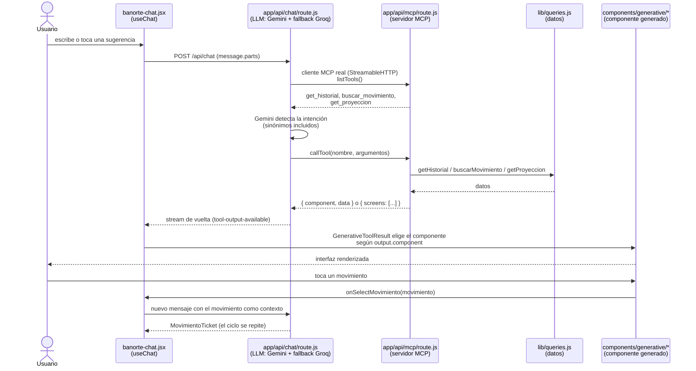
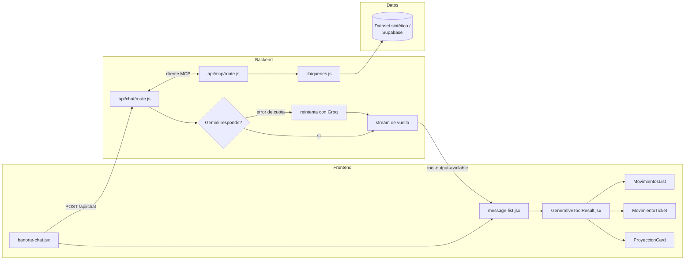

# Arquitectura — Banorte GEN-AI

Diagrama de las 3 piezas obligatorias del reto (LLM, MCP, A2UI) mapeadas a
los archivos reales del repo, y el ciclo completo de una interacción.

## Flujo completo

## Las 3 piezas obligatorias, mapeadas

| Pieza del reto | Cómo la resolvemos | Archivo |
|---|---|---|
| **LLM al centro** | Gemini 3.6 Flash interpreta intención y decide qué tool llamar; Groq (`openai/gpt-oss-120b`) como fallback automático si Gemini falla por cuota | `app/api/chat/route.js` |
| **MCP** | Servidor MCP real (protocolo Streamable HTTP), no tools "pegadas" al código del chat — el chat se conecta como cliente MCP genuino a su propio servidor | `app/api/mcp/route.js` |
| **A2UI (equivalente)** | Vercel AI SDK: `useChat` + `message.parts` transmiten qué componente renderizar y con qué datos; el resultado de cada tool viaja como parte del mensaje | `components/banorte-chat.jsx`, `components/message-list.jsx` |

## Contrato de datos entre MCP y la UI

Cada tool regresa uno de estos dos shapes (ver `CONTEXT.md` para el detalle
completo del contrato):

- **Una pantalla:** `{ component: "MovimientosList", data: {...} }`
- **N pantallas** (flujos accionables con pasos, ej. confirmar → resultado):
  `{ screens: [{ component, data }, { component, data }, ...] }`

`GenerativeToolResult.jsx` decide con cuál de los dos casos está trabajando y
elige el componente real a renderizar — la lógica de cada tarjeta vive una
sola vez, sin duplicarse entre el caso de 1 pantalla y el de N.

## Componentes del sistema

## Tradeoffs y decisiones — ver `DECISIONS.md`

El porqué de cada elección (modelo, protocolo, infraestructura) está en
[`DECISIONS.md`](./DECISIONS.md). El estado técnico completo, bugs
encontrados y bitácora de cambios está en [`CONTEXT.md`](./CONTEXT.md).
